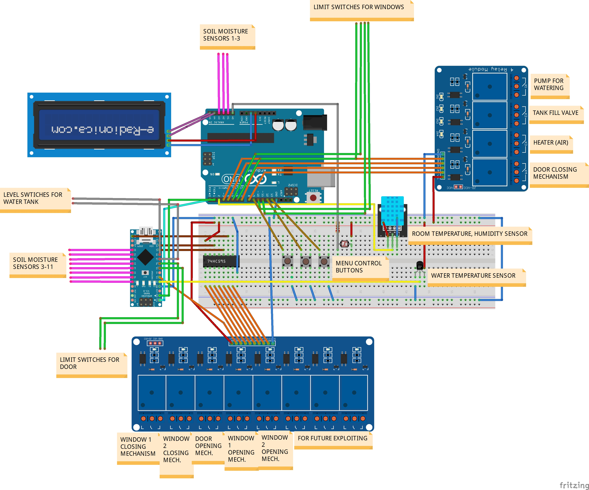
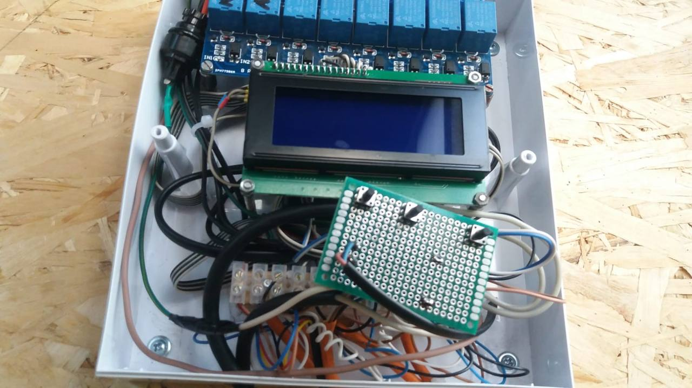
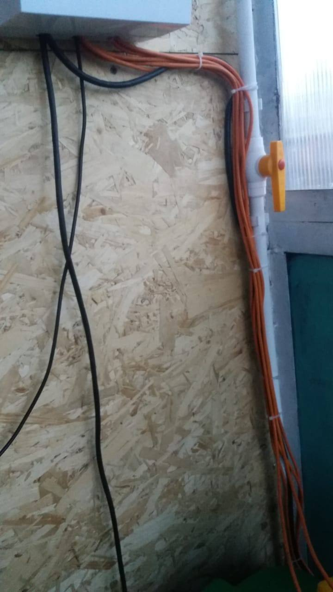
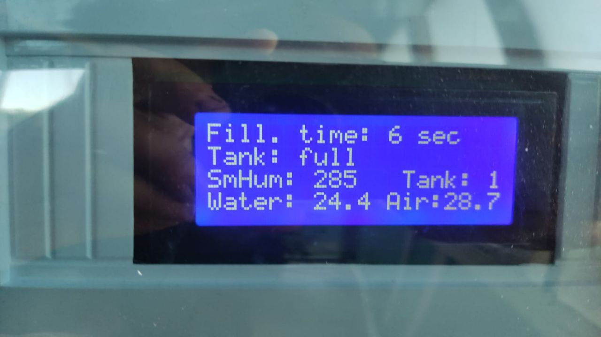
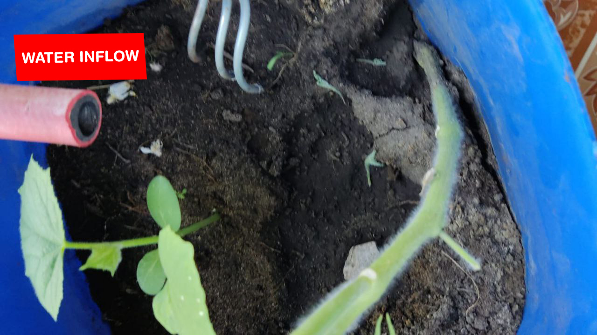
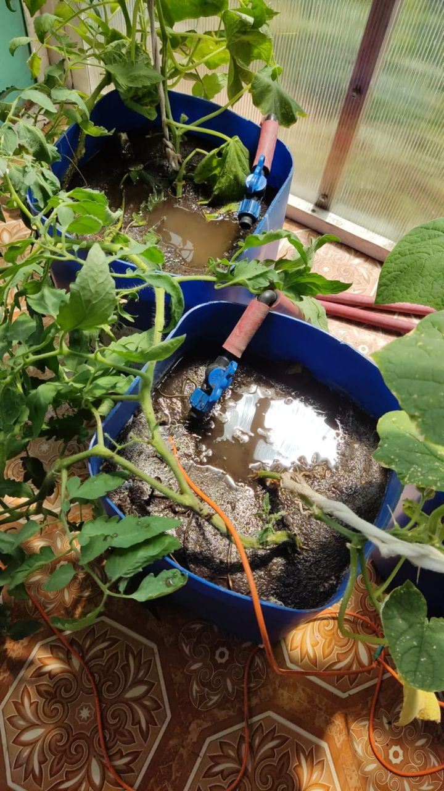
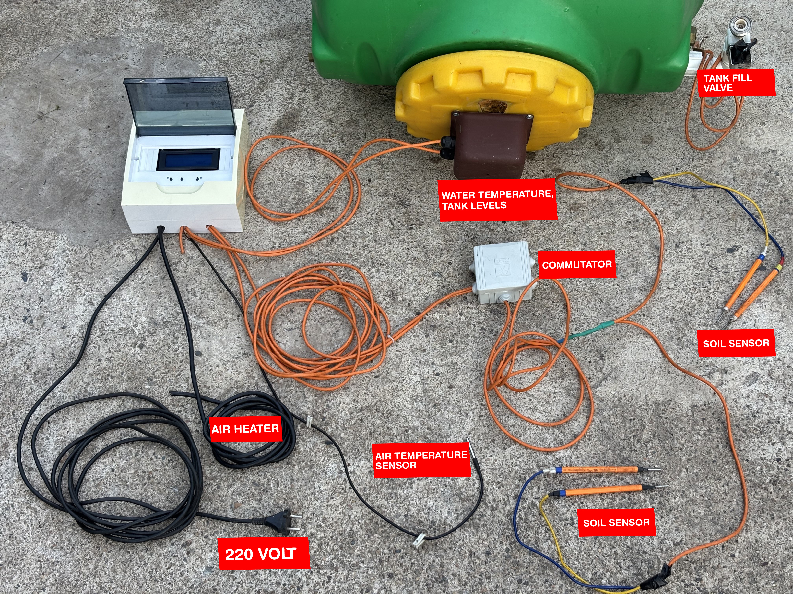

# 🛠️ Smart Greenhouse Automation System 🌿



---

## 🔥 Project Description

**Fully autonomous greenhouse system**, built by me at just **14 years old**.  
It includes:

✅ Automated cucumber watering with DIY soil moisture sensors  
✅ Air temperature control with automatic heater activation  
✅ Automated water tank refill system  
✅ Dual microcontroller setup — *Arduino Nano* + *Arduino Uno*  

I designed, soldered, and coded the entire system myself, including diagrams and control logic.

---

## 📸 Project Gallery

### 📟 Main Controller


### 💧 DIY Soil Moisture Sensors


### 🛢️ Water Tank Setup


### 🔌 Internal Wiring and Cable Management



### 🌡️ Status Display


### 🌿 Buckets Watering Setup



### 🔧 Full System Overview


---

## 🧩 Technical Highlights

- 11 DIY analog soil moisture sensors  
- DS18B20 digital temperature sensors ( for water and air )  
- **Arduino Uno** — system brain (pumps, heater, windows, valve, etc.)  
- **Arduino Nano** — dedicated to reading analog sensors, controlling relays  
- Serial communication between Arduinos  
- Relay modules for pump & heater control, valve, windows opening, door opening  
- LCD display for real-time status  
- System protection with fuses & circuit separation  

---

## 💡 Why This is Awesome

- 🧠 Designed, soldered, and coded by me personally  
- 🚀 Completed at age **14**, proving solid skills in electronics & microcontrollers  
- 🌱 Real-world solution for automated plant care, time-saving, better yield  


## 📂 Project Structure
```
src/assets/           # Photos and diagrams
src/arduino_code/     # Source code for Arduino Uno & Nano
README.md             # You're reading it
```

## 🤝 Contact

**Interested in Arduino projects or collabs? Let's connect — I'd love to help! 🙌**
